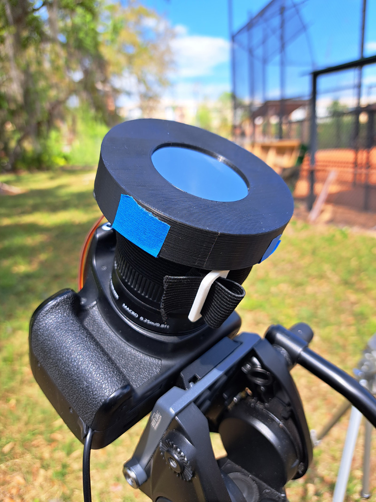

# Motorized Solar Filter

A 3D printed solar filter that uses an SG90 servo to remove the solar film from your camera during totality!

## Materials

- 1 x [Filter inner piece](/stl/filter-inner.stl)
- 1 x [Filter outer piece](/stl/filter-outer.stl)
- 1 x [Servo holder](/stl/servo-holder.stl)
- 1 x [Tri-glide](/stl/tri-glide.stl) (quad-glide?)
- ~35cm long piece of 25mm width grippy/non-stick elastic band/strap (I used [this one from AliExpress](https://www.aliexpress.us/item/3256804311416876.html))
- Sheet of solar film at least 3x3 inches in size (I used this [Thousand Oaks film](https://www.amazon.com/Solar-Filter-Telescopes-Binoculars-Cameras/dp/B01770FDAC/))
- 1 x SG90 servo motor with attachment screws and ~21mm long servo arm/horn (I've tested [these](https://www.aliexpress.us/item/3256805486647239.html) and [these](https://www.amazon.com/dp/B07MLR1498))

## Instructions

Coming soon!

*Note: this filter was designed for 58mm outer diameter lenses (i.e. ø58mm). Because of the design's flexibility, it may work for smaller or similarly-sized lenses, but I haven't been able to confirm this myself.*